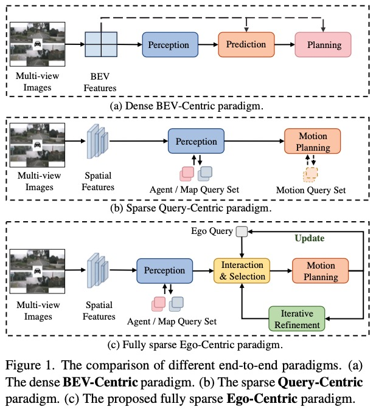
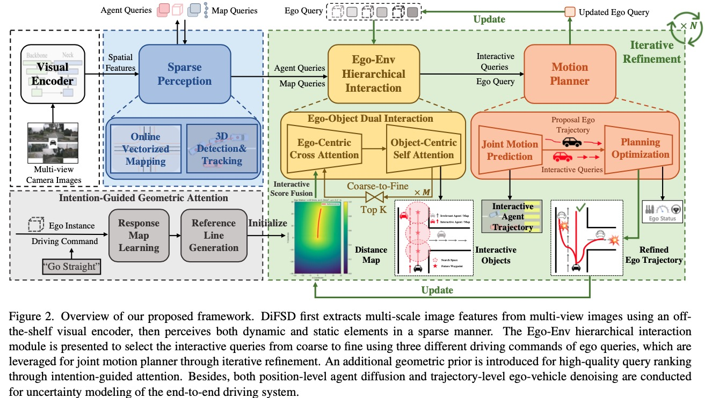
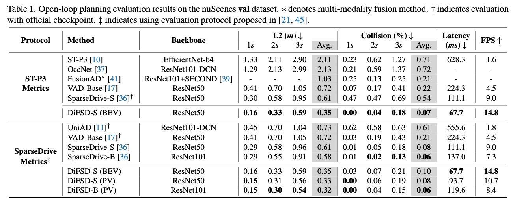
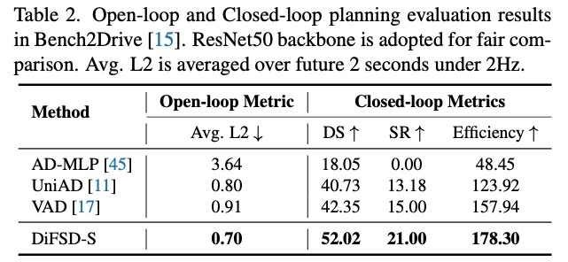
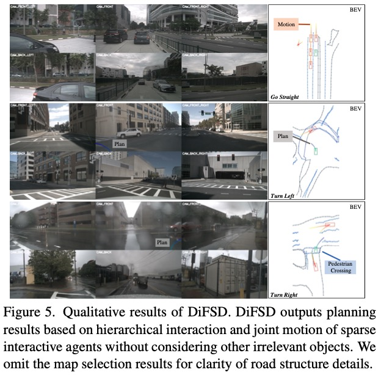

<div align="center">

<h1>DiFSD</h1>
<h3>Ego-Centric Fully Sparse Paradigm with Uncertainty Denoising and Iterative Refinement for Efficient End-to-End Self-Driving</h3>

[Haisheng Su](https://scholar.google.com.hk/citations?user=OFrMZh8AAAAJ&hl=zh-CN)<sup>1,2</sup>,  [Wei Wu](https://scholar.google.com.hk/citations?hl=zh-CN&user=9RBxtd8AAAAJ)<sup>2</sup>, [Junchi Yan](https://thinklab.sjtu.edu.cn/)<sup>1 :email:</sup>

<sup>1</sup> School of AI and Department of CSE, SJTU, <sup>2</sup> SenseAuto Research

(<sup>:email:</sup>) corresponding author, yanjunchi@sjtu.edu.cn

[](https://arxiv.org/abs/2409.09777)

</div>


## News
* **` Sep. 9th, 2024`:** We released our paper on [Arxiv](https://arxiv.org/abs/2409.09777). Code/Models  are coming soon. Please stay tuned! ☕️


## Table of Contents
- [Introduction](#introduction)
- [Framework](#framework)
- [Open-loop Planning Evaluation](#open-loop-planning-evaluation)
- [Closed-loop Planning Evaluation](#closed-loop-planning-evaluation)
- [Qualitative Visualization](#qualitative-visualization)
- [Contact](#contact)
- [Citation](#citation)


## Introduction
<div align="center">

</div>
Current end-to-end autonomous driving methods resort to unifying modular designs for various tasks (e.g. perception, prediction and planning). Although optimized in a planning-oriented spirit with a fully differentiable framework, existing end-to-end driving systems without ego-centric designs still suffer from unsatisfactory performance and inferior efficiency, owing to the rasterized scene representation learning and redundant information transmission. In this paper, we revisit the human driving behavior and propose an ego-centric fully sparse paradigm, named DiFSD, for end-to-end self-driving. Specifically, DiFSD mainly consists of sparse perception, hierarchical interaction and iterative motion planner. The sparse perception module performs detection, tracking and online mapping based on sparse representation of the driving scene. The hierarchical interaction module aims to select the Closest In-Path Vehicle / Stationary (CIPV / CIPS) from coarse to fine, benefiting from an additional geometric prior. As for the iterative motion planner, both selected interactive agents and ego-vehicle are considered for joint motion prediction, where the output multi-modal ego-trajectories are optimized in an iterative fashion. Besides, both position-level motion diffusion and trajectory-level planning denoising are introduced for uncertainty modeling, thus facilitating the training stability and convergence of the whole framework. Extensive experiments conducted on nuScenes and Bench2Drive datasets demonstrate the superior planning performance and great efficiency of DiFSD.


## Framework

<div align="center">

</div>

## Open-loop Planning Evaluation
<div align="center"></div>

## Closed-loop Planning Evaluation
<div align="center"></div>

## Qualitative Visualization
<div align="center">

</div>

## Getting Started
TBD


## Contact
If you have any questions, please contact [Haisheng Su](https://scholar.google.com.hk/citations?user=OFrMZh8AAAAJ&hl=zh-CN) via email (suhaisheng@sjtu.edu.cn).


## Citation
If you find DiFSD is useful in your research or applications, please consider giving us a star 🌟 and citing it by the following BibTeX entry.

```bibtex
@article{su2024difsd,
  title={DiFSD: Ego-Centric Fully Sparse Paradigm with Uncertainty Denoising and Iterative Refinement for Efficient End-to-End Self-Driving},
  author={Su, Haisheng and Wu, Wei and Yan, Junchi},
  journal={arXiv preprint arXiv:2409.09777},
  year={2024}
}
```